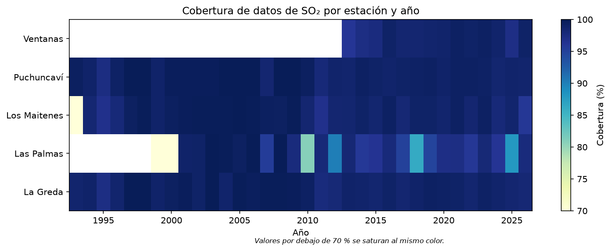
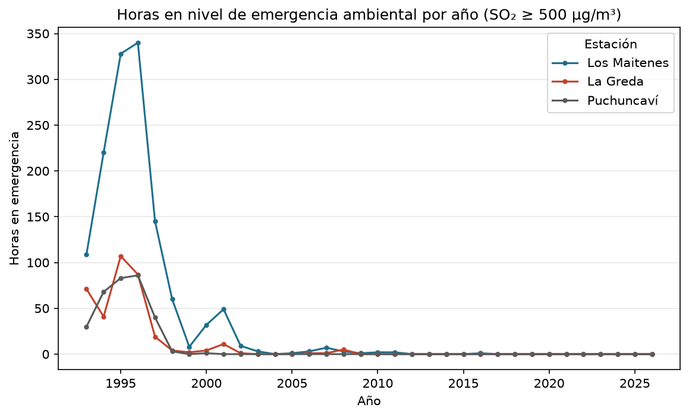
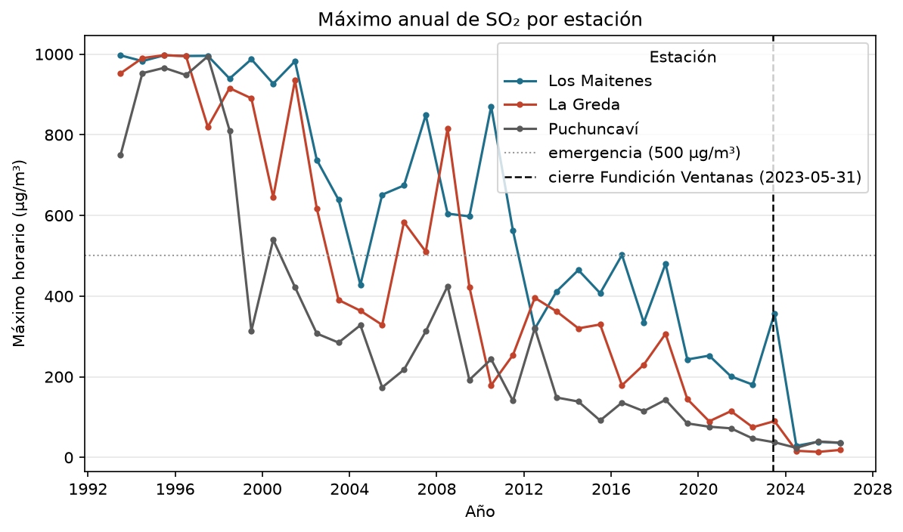
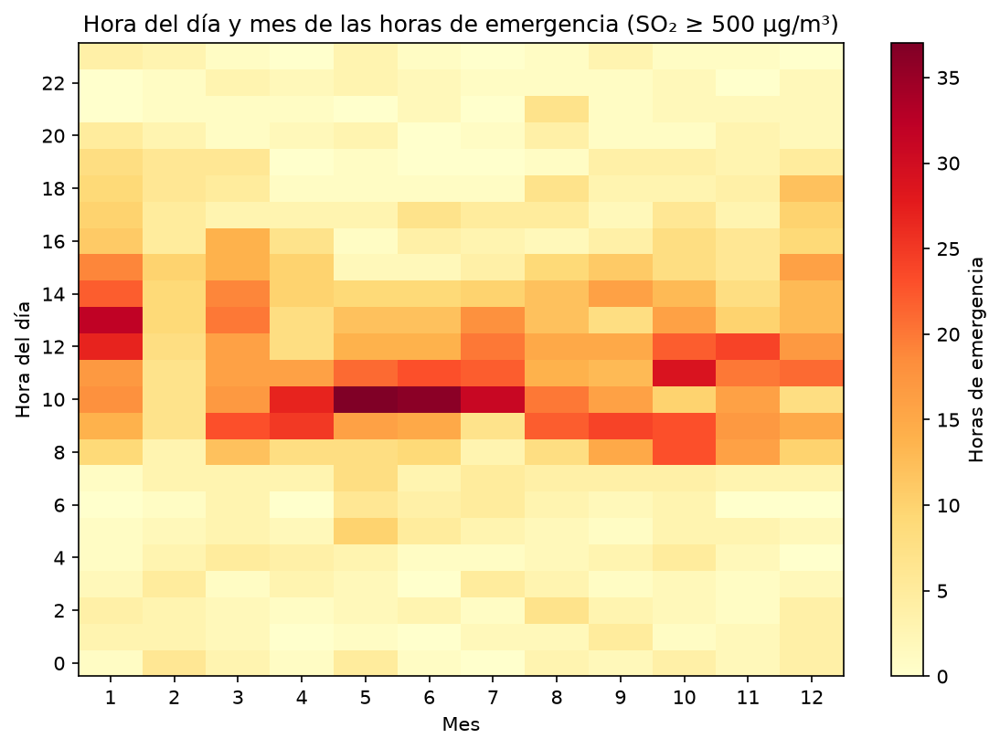
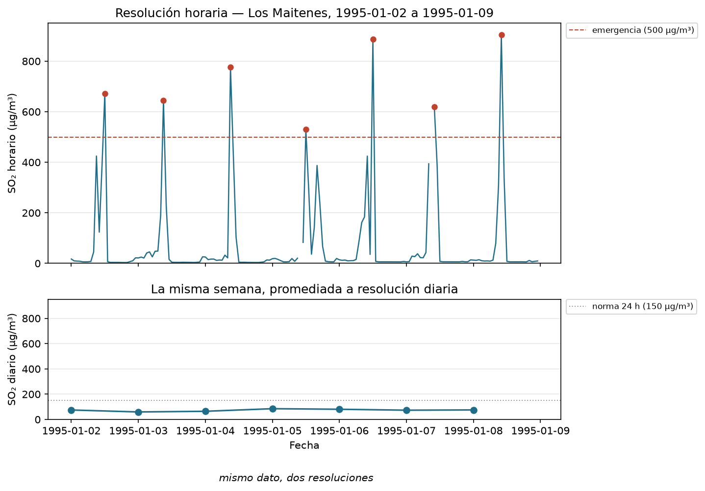

# calidad-aire-quintero

SO₂ en Quintero-Puchuncaví: 33 años de datos horarios en tres estaciones, y
qué cambió tras el cierre de la Fundición Ventanas.

> **Estado del repositorio: Fase 2 de 5 — EDA y el hallazgo de resolución.**
> Este README refleja exclusivamente lo que produce `caq eda` (`reports/eda.json`
> y `reports/figures/`). La recuperación tras el cierre, el pronóstico y el
> dashboard llegan en las fases siguientes.

## El problema

El 31 de mayo de 2023 comenzó el cierre de la Fundición Ventanas de Codelco,
tras 58 años de operación en la bahía de Quintero-Puchuncaví, una de las
zonas de sacrificio ambiental más documentadas de Chile. Tres estaciones de
monitoreo de SINCA (Sistema de Información Nacional de Calidad del Aire),
independientes entre sí, llevan alrededor de 33 años midiendo SO₂ cada hora
alrededor del complejo industrial.

Este repositorio hace dos cosas con esos datos:

1. Mide qué cambió antes y después del cierre, con la evidencia de tres
   instrumentos a la vez (fases 2 y 3).
2. Muestra, con reconstrucción numérica, que el dato público que cualquier
   persona consulta en resolución diaria nunca habría mostrado los episodios
   de emergencia ambiental que sí ocurrieron por SO₂ (fase 2).

No es un ejercicio de modelamiento: es evidencia sobre un lugar real, con sus
confusores declarados explícitamente.

## Los datos

Fuente: [SINCA](https://sinca.mma.gob.cl/), Ministerio del Medio Ambiente de
Chile. Descarga horaria (y diaria donde se indica) para cinco estaciones de
la bahía. `las_palmas` (Viña del Mar) es la estación de contraste urbano,
fuera de la influencia directa del complejo industrial.

| estación | parámetro | periodo | filas | cobertura |
|---|---|---|---|---|
| los_maitenes | SO₂ | 1993-03-31 → 2026-09-14 | 293.303 | 97 % |
| la_greda | SO₂ | 1993-01-01 → 2026-09-15 | 295.463 | 99 % |
| puchuncavi | SO₂ | 1993-01-01 → 2026-09-15 | 295.463 | 99 % |
| ventanas | SO₂ | 2013-01-01 → 2026-09-14 | 120.119 | 98 % |
| las_palmas | SO₂ | 1999-02-06 → 2026-09-14 | 241.991 | 91 % |
| puchuncavi | dirección y velocidad de viento | 2009-12-31 → 2026-09-16 | 146.495 | 99 % |
| ventanas | dirección y velocidad de viento | 2013-01-01 → 2026-09-15 | 120.143 | 98 % |
| la_greda | dirección y velocidad de viento | 1970-01-01 → 2026-09-16 | 497.111 | 29 % |
| las_palmas | dirección de viento | 2007-10-01 → 2026-07-10 | 164.591 | 42 % |
| los_maitenes | SO₂ diario | 2000-08-21 → 2026-08-20 | 9.496 | 99,3 % |

`filas` es el número de registros del CSV crudo (con o sin valor); la
cobertura real (horas con valor sobre horas totales) se calcula por estación
y año en `caq eda` (`eda.cobertura_por_estacion_y_anio`):



Los huecos blancos son años en que la estación todavía no existía (p. ej.
`ventanas` empieza en 2013) o en que su cobertura de viento apenas arrancaba
(`las_palmas`, 1999-2000); una vez operando, las cinco estaciones rondan el
95-100 % de cobertura casi todos los años.

### El contrato de datos

Cada CSV crudo se convierte a una fila `(estacion, parametro, fecha_hora,
valor, estado)`. `parametro` conserva la resolución temporal en el nombre del
fichero (p.ej. `so2_horario` frente a `so2_diario`): son series distintas y
no se mezclan bajo la misma clave.

Rangos físicos exigidos antes de que un valor se considere válido:

| parámetro | rango |
|---|---|
| SO₂, NO₂, O₃, MP10, MP25, CO | ≥ 0 |
| dirección de viento | 0° – 360° |
| velocidad de viento | 0 – 60 m/s |
| fecha_hora | 1970-01-01 – hoy |

Lo que no cumple el contrato **no se borra ni se imputa**: va a
`data/quarantine/<timestamp>.csv` con una columna `motivo`. El caso conocido
de esta descarga es una lectura de **90.114,5 m/s** de velocidad de viento en
`la_greda` — muy por encima del récord mundial (≈113 m/s).

### Qué se versiona y qué no

- `data/raw/` (112 MB de CSV de SINCA) **no se versiona**: está en
  `.gitignore`. Ver más abajo cómo rehacer la descarga.
- `data/processed/sinca.parquet` sí se versiona, pero **solo con SO₂ y
  viento** (dirección y velocidad), con `estacion`/`parametro`/`estado` como
  `category`, `valor` en `float32` y compresión `zstd` (nivel 15): con los 11
  parámetros completos pesa 56 MB (34 MB incluso con esas mismas
  optimizaciones y zstd nivel 19), por encima del límite de 25 MB fijado para
  este repositorio; con SO₂ y viento pesa **19,62 MB**. NO₂, O₃, MP10, MP25 y
  CO quedan validados durante la ingesta pero no persistidos — se recuperan
  re-ejecutando `caq ingest` sobre `data/raw/`. SO₂ y viento son, además, los
  únicos
  parámetros que usan las fases 2 a 4 (recuperación y pronóstico).
- `data/quarantine/` tampoco se versiona (son datos derivados,
  reproducibles desde `data/raw/`).

### Cómo rehacer la descarga

1. Ir a <https://sinca.mma.gob.cl/> → Consulta de datos.
2. Para cada estación (`Los Maitenes`, `La Greda`, `Puchuncaví`, `Ventanas`,
   `Las Palmas`) y cada parámetro (`SO2`, `NO2`, `O3`, `MP10`, `MP2,5`, `CO`
   donde exista, dirección y velocidad de viento), exportar la serie
   **por registro** (no una tabla resumen / rosa de vientos) en resolución
   horaria — y, para `los_maitenes`, también la diaria de SO₂, MP10 y MP2,5.
3. Guardar cada export como
   `data/raw/<estacion>/<parametro>_<resolucion>.csv`, por ejemplo
   `data/raw/los_maitenes/so2_horario.csv`. El nombre del fichero es la
   fuente de verdad del parámetro para el pipeline.
4. Ejecutar `make ingest` (equivalente a `uv run caq ingest`).

## Los episodios de SO₂

"Episodio" = una hora con SO₂ ≥ 500 µg/m³N, el umbral legal de **emergencia
ambiental** (D.S. 104/2018, ICAG SO₂ ≥ 200). Sumando `los_maitenes`,
`la_greda` y `puchuncavi` (las tres estaciones que rodean el complejo
industrial):

| periodo | horas en emergencia |
|---|---|
| 1993–1999 | **1.851** |
| 2000–2009 | 132 |
| 2010–2019 | 5 |
| **2020–2026** | **0** |





Estos números describen la serie; **por qué cambiaron** -- qué se le puede
atribuir al cierre de la Fundición Ventanas y qué no -- es el análisis de la
fase 3, con sus confusores declarados.

Las horas de emergencia tampoco se reparten parejo en el día: se concentran
a media mañana.



El pico está entre las 08:00 y las 14:00 -- consistente con la brisa de valle
que sopla desde el complejo industrial hacia las estaciones de monitoreo
durante esas horas -- y se repite todos los meses del año, sin un patrón
estacional marcado.

## Por qué el dato público no muestra los episodios

La norma D.S. 104/2018 fija dos ventanas de tiempo distintas para el SO₂: 350
µg/m³ en 1 hora, y 150 µg/m³ como promedio de 24 horas. Es esta segunda
cifra -- la resolución diaria -- la que un ciudadano común consulta primero:
es la que SINCA muestra por defecto y la que reportan los medios.

**Verificación:** promediar la serie horaria de `los_maitenes` a diaria
reproduce la serie diaria publicada (`so2_diario.csv`) en **99,9 %** de los
9.427 días comparables (tolerancia 1 µg/m³), con una diferencia mediana de
**0,000 µg/m³**. No son dos fuentes distintas: es el mismo instrumento, el
mismo dato, a dos resoluciones.

Con esa reconstrucción confirmada, la comparación en la misma estación y el
mismo periodo (2000-08-21 a 2026-08-20) es directa:

| | superaciones |
|---|---|
| Serie **diaria**, norma 24 h (150 µg/m³) | **2 en 26 años**, ninguna desde 2019 |
| Serie diaria, máximo histórico | 157,58 µg/m³ |
| Serie **horaria**, emergencias (≥ 500 µg/m³) | **1.323** |

La serie diaria nunca ve una emergencia porque un promedio de 24 horas diluye
un pico de una o dos horas hasta hacerlo invisible: 1.323 horas por encima
del umbral legal de emergencia, comprimidas en un promedio diario, dejan
rastro en solo 2 días de 9.427. La figura siguiente es la misma semana de
enero de 1995 dibujada dos veces, en las dos resoluciones:



## Quickstart

```bash
uv sync
make lint
make test
make ingest
make eda
```

Todos los comandos pasan por `uv run`: el Python del sistema en macOS es
3.9.6 y el proyecto necesita 3.11.

## Estructura

```
src/calidad_aire/   ingest, schema, data, eda, figures, cli
tests/              cobertura >= 80 %
config/             default.yaml (semilla 42)
data/raw/           CSV de SINCA (no versionado)
data/processed/     sinca.parquet (versionado, solo SO2 y viento)
data/quarantine/    filas que violan el contrato (no versionado)
reports/            eda.json, figures/*.png (versionados, CLAUDE.md §2.11)
tools/fase.py
```

## Fuentes

- **SINCA** — Sistema de Información Nacional de Calidad del Aire, Ministerio
  del Medio Ambiente. <https://sinca.mma.gob.cl/>
- **D.S. 104/2018**, norma primaria de calidad del aire para SO₂, MMA.
- **Cierre de la Fundición Ventanas (Codelco)**, primera fase el 31 de mayo de
  2023, tras 58 años de operación.

## Autor

[@ajmedinaa-gif](https://github.com/ajmedinaa-gif)
